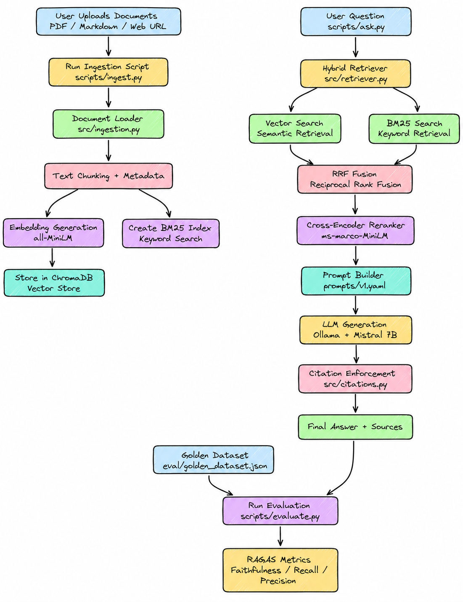

<div align="center">

# Ask My Docs
### A Production-Grade RAG System — 100% Free, 100% Local

[](https://python.org)
[](https://ollama.com/library/mistral)
[](https://www.trychroma.com/)
[](https://langchain.com)
[](LICENSE)
[]()

<br/>

> **Ingest any PDF, Markdown, or web page. Ask questions. Get cited answers. Zero hallucinations.**
> No API keys. No cloud. No cost. Runs entirely on your machine.

<br/>

---

</div>

---
 
## 📌 Table of Contents
 
- [What is This?](#-what-is-this)
- [Why This Matters](#-why-this-matters)
- [Tech Stack](#-tech-stack)
- [Project Structure](#-project-structure)
- [Pipeline Deep Dive](#-pipeline-deep-dive)
  - [System Architecture Diagram](#system-architecture-diagram)
  - [Phase 1 — Document Ingestion](#phase-1--document-ingestion)
  - [Phase 2 — Hybrid Retrieval & Generation](#phase-2--hybrid-retrieval--generation)
  - [Phase 3 — Evaluation & CI/CD](#phase-3--evaluation--cicd)
- [Quick Start](#-quick-start)
- [Usage](#-usage)
- [Configuration](#-configuration)
- [Evaluation](#-evaluation)
- [Running Tests](#-running-tests)
- [Key Design Decisions](#-key-design-decisions)
- [Roadmap](#-roadmap)

---

## What is This?

**Ask My Docs** is a domain-specific question-answering system built on the RAG (Retrieval-Augmented Generation) architecture. Feed it your documents — research papers, legal contracts, healthcare records, technical manuals — and ask questions in plain English. Every answer comes with citations pointing to the exact source chunk that supports the claim.

**Without citations → hallucination. With citations → trust.**

This is not a prototype. It implements the full production RAG stack:

- **Hybrid retrieval** (BM25 + vector search fused with Reciprocal Rank Fusion)
- **Cross-encoder reranking** for precision after broad-net recall
- **Citation enforcement** — the system says *"I cannot answer"* rather than guessing
- **Versioned prompts** stored in config files, tracked by git
- **Offline RAGAS evaluation** with a CI/CD quality gate on every PR

Everything runs **locally and for free**. No OpenAI key. No Pinecone account. No data sent anywhere.

---

## Why This Matters

Large language models hallucinate because they generate the most *probable* next token — not the most *grounded* one. RAG fixes this by forcing the model to answer **only from retrieved evidence**. Citations make every claim auditable.

| Without RAG | With Ask My Docs |
|---|---|
| Model answers from training data | Model answers only from your documents |
| No way to verify a claim | Every claim cites its source chunk |
| Hallucination is invisible | Unsupported answers are blocked |
| Generic knowledge | Domain-specific precision |
| Stale information | Always reflects your latest docs |

---

## Tech Stack

> Every tool in this stack is **free and open source**. No API keys. No billing.

| Layer | Tool | Why |
|---|---|---|
| **Document Loading** | PyMuPDF, BeautifulSoup4 | Layout-aware PDF parsing; clean web scraping |
| **Chunking** | LangChain `RecursiveCharacterTextSplitter` | Natural boundary splits (paragraph → sentence → word) |
| **Embeddings** | `sentence-transformers/all-MiniLM-L6-v2` | 384-dim, 80MB, CPU-friendly; within 5% of OpenAI on MTEB |
| **Vector Store** | ChromaDB (local SQLite) | Zero config, persists to disk, metadata filtering |
| **Keyword Search** | `rank-bm25` (BM25Okapi) | Exact phrase and rare term matching |
| **Hybrid Fusion** | Reciprocal Rank Fusion (RRF) | Score-agnostic rank fusion from TREC research |
| **Reranker** | `cross-encoder/ms-marco-MiniLM-L-6-v2` | 70MB cross-encoder trained on 500K MS MARCO pairs |
| **LLM** | Mistral 7B v0.3 via Ollama | Best-in-class instruction following at 7B, ~4GB RAM |
| **Prompt Versioning** | YAML config files | Prompts are architecture — git-tracked like code |
| **Evaluation** | RAGAS | Offline faithfulness, relevancy, and precision scoring |
| **Orchestration** | LangChain + LangGraph | Modular, swappable pipeline components |
| **CI/CD** | GitHub Actions | Auto-eval on every PR; fails build on quality regression |

---

## Project Structure

```
ask_my_docs/
│
├── 📄 config.py                    # Central config — every parameter in one place
├── 📄 requirements.txt             # All dependencies (pinned versions)
├── 📄 setup_check.py               # Environment verification script
│
├── 📂 prompts/
│   └── v1.yaml                    # Versioned prompt templates (git-tracked)
│
├── 📂 src/                         # Core pipeline modules
│   ├── ingestion.py               # PDF / Markdown / Web → chunked Documents
│   ├── embeddings.py              # all-MiniLM-L6-v2 wrapper (singleton)
│   ├── vectorstore.py             # ChromaDB read / write / reset
│   ├── bm25_index.py              # BM25Okapi keyword index (persisted to disk)
│   ├── retriever.py               # Hybrid RRF fusion (BM25 + vector → top-20)
│   ├── reranker.py                # Cross-encoder reranker (top-20 → top-5)
│   ├── citations.py               # [Chunk N] parser + hallucination gate
│   ├── generator.py               # Ollama/Mistral call with prompt versioning
│   └── pipeline.py                # Wires all stages: question → RAGResponse
│
├── 📂 scripts/                     # CLI entry points
│   ├── ingest.py                  # Ingest documents into the vector store
│   ├── ask.py                     # Ask questions (single or interactive mode)
│   └── evaluate.py                # Run RAGAS evaluation against golden dataset
│
├── 📂 eval/
│   └── golden_dataset.json        # Verified QA pairs for benchmarking
│
├── 📂 tests/
│   └── test_pipeline.py           # 15 unit tests (chunking, BM25, RRF, citations)
│
├── 📂 docs/                        # Drop your documents here
│
├── 📂 chroma_db/                   # Auto-created — vector store + BM25 index
│
└── 📂 .github/workflows/
    └── rag_quality_gate.yml       # CI/CD: auto-eval on every pull request
```

---

## Pipeline Deep Dive

### System Architecture Diagram

The diagram below shows the full end-to-end flow — from raw documents on the left, through hybrid retrieval and reranking, to a cited answer on the right. Refer back to this as you read through each phase.



---

### Phase 1 — Document Ingestion

```
PDF / Markdown / Web URL
         │
         ▼
   [ Document Loader ]          PyMuPDF (PDF) · UnstructuredMarkdown · WebBaseLoader
         │
         ▼
   [ Chunking ]                 600 tokens · 100 token overlap · natural boundary splits
         │
         ▼
   [ Metadata Injection ]       chunk_id · source · page · preview (for citations)
         │
    ┌────┴────┐
    ▼         ▼
[ Embed ]  [ BM25 Index ]       all-MiniLM-L6-v2 (384-dim) · BM25Okapi keyword index
    │
    ▼
[ ChromaDB ]                    Local SQLite vector store — persisted to disk
```

**Why 600 tokens with 100-token overlap?**
Too small (< 200 tokens) and chunks lose context. Too large (> 1200 tokens) and retrieval becomes imprecise. The 100-token overlap ensures sentences near chunk boundaries appear in both adjacent chunks — no context is lost at the seam.

**Why `RecursiveCharacterTextSplitter`?**
It tries natural boundaries first: paragraph → line → sentence → word → character. This keeps coherent ideas together instead of cutting mid-sentence at a hard character limit.

---

### Phase 2 — Hybrid Retrieval & Generation

```
User Question
      │
      ├─────────────────────┬────────────────────┐
      ▼                     ▼                    │
[ Vector Search ]     [ BM25 Search ]            │
  semantic meaning      exact keywords           │
  top-20 results        top-20 results           │
      │                     │                    │
      └──────────┬──────────┘                    │
                 ▼                               │
       [ RRF Fusion ]                            │
    Reciprocal Rank Fusion                       │
    score-agnostic rank merge                    │
                 │                               │
                 ▼                               │
      [ Cross-Encoder Reranker ]          [ Prompt Config ]
     ms-marco-MiniLM-L-6-v2              prompts/v1.yaml
     top-20 → top-5 (precision)          versioned by git
                 │                               │
                 └──────────────┬────────────────┘
                                ▼
                    [ Context Builder ]
                    [Chunk 1] source · page
                    [Chunk 2] source · page ...
                                │
                                ▼
                       [ Mistral 7B ]
                    via Ollama (local, free)
                                │
                                ▼
                    [ Citation Parser ]
                    extract [Chunk N] refs
                                │
                                ▼
                    [ Hallucination Gate ]
                    no citation? → BLOCKED
                    cannot answer? → ACCEPTED
                                │
                                ▼
                    [ RAGResponse ]
                    answer + citations + sources
```

**Why Hybrid Retrieval?**

| Signal | Wins on | Fails on |
|---|---|---|
| **Vector search** | Synonyms, paraphrases, concepts | Rare terms, model names, exact versions |
| **BM25** | Exact phrases, acronyms, IDs | Semantic similarity, cross-lingual |
| **Hybrid (RRF)** | Both — ~15–25% better than either alone | — |

**Why two retrieval stages?**
Bi-encoders are fast but encode query and document separately — they miss interactions. Cross-encoders read query + document together (much more accurate) but are 100× slower. The two-stage approach: cast a wide net cheaply (top-20), then score precisely (top-5).

**Why Reciprocal Rank Fusion?**
BM25 scores are unbounded; cosine similarities are [0,1]. You can't directly compare them. RRF uses only *rank positions* (`score = 1 / (rank + 60)`), so no normalization is needed. The constant 60 was empirically determined from TREC experiments.

---

### Phase 3 — Evaluation & CI/CD

```
Golden Dataset (50–200 verified QA pairs)
              │
              ▼
     [ Run Pipeline on each QA pair ]
              │
              ▼
     [ RAGAS Scoring ]
     ┌─────────────────────────────────────┐
     │  faithfulness        ≥ 0.85         │  ← Is every claim grounded?
     │  answer_relevancy    ≥ 0.80         │  ← Does it address the question?
     │  context_precision   ≥ 0.75         │  ← Are retrieved chunks relevant?
     └─────────────────────────────────────┘
              │
     ┌────────┴────────┐
     ▼                 ▼
  PASS (0)          FAIL (1)
  PR merges         PR blocked
```

**What is faithfulness?**
RAGAS decomposes every sentence in the answer into atomic claims, then checks whether each claim is supported by the retrieved chunks. Score = supported claims / total claims. This is your hallucination detector.

---

##  Quick Start

### Prerequisites

- Python 3.11+
- [Ollama](https://ollama.com) installed
- Mistral 7B pulled: `ollama pull mistral`

### Installation

```bash
# 1. Clone the repo
git clone https://github.com/yourusername/ask_my_docs.git
cd ask_my_docs

# 2. Create and activate virtual environment
python -m venv venv

# Windows
venv\Scripts\activate

# macOS / Linux
source venv/bin/activate

# 3. Install dependencies
pip install -r requirements.txt

# 4. Verify everything is ready
python setup_check.py
```

You should see ` All checks passed!` before continuing.

---

## Usage

### Ingest Documents

```bash
# Ingest a PDF
python scripts/ingest.py --source docs/your_paper.pdf

# Ingest a Markdown file
python scripts/ingest.py --source docs/notes.md

# Ingest a web page
python scripts/ingest.py --source https://example.com/article

# Ingest multiple sources at once
python scripts/ingest.py --source paper1.pdf --source paper2.pdf

# Ingest all files in a folder
python scripts/ingest.py --folder docs/

# Reset everything and re-ingest (clean slate)
python scripts/ingest.py --source docs/paper.pdf --reset
```

**Expected output:**
```
 Ingestion complete!
   Documents loaded : 21 page(s)
   Chunks created   : 224
   Total in store   : 224
```

---

### Ask Questions

```bash
# Interactive mode (recommended)
python scripts/ask.py --interactive

# Single question
python scripts/ask.py --question "What is retrieval augmented generation?"

# JSON output for programmatic use
python scripts/ask.py --question "What are RAG challenges?" --json

# Verbose mode (shows retrieval pipeline stages)
python scripts/ask.py --interactive --verbose
```

**Example answer:**
```
============================================================
QUESTION: What is retrieval augmented generation?
============================================================

ANSWER:
Retrieval Augmented Generation (RAG) is a framework that enhances
large language models by retrieving relevant information from external
knowledge sources before generating responses [Chunk 2]. It combines
the parametric knowledge of LLMs with non-parametric retrieval systems
to reduce hallucination and improve factual accuracy [Chunk 3].

────────────────────────────────────────────────────────────
CITATIONS (2):
  [1] Chunk 2 | docs/RAG.pdf | Page 1
       Score: 0.934
       "RAG integrates retrieval mechanisms with generative models..."

  [2] Chunk 3 | docs/RAG.pdf | Page 2
       Score: 0.871
       "The framework addresses the knowledge limitations of LLMs..."
============================================================
```

**When information is not in the documents:**
```
 I cannot answer this question from the provided documents.
```

This is the hallucination gate working — the system refuses to guess.

---

##  Configuration

All parameters live in `config.py`. Change here, affects everywhere.

```python
# Chunking
CHUNK_SIZE      = 600    # tokens per chunk (sweet spot: 500–800)
CHUNK_OVERLAP   = 100    # overlap between adjacent chunks

# Retrieval
VECTOR_TOP_K    = 20     # candidates from vector search
BM25_TOP_K      = 20     # candidates from BM25 search
RRF_K_CONSTANT  = 60     # RRF fusion constant (from TREC research)
RERANK_TOP_K    = 5      # chunks sent to LLM after reranking

# Models
EMBEDDING_MODEL = "sentence-transformers/all-MiniLM-L6-v2"
RERANKER_MODEL  = "cross-encoder/ms-marco-MiniLM-L-6-v2"
OLLAMA_MODEL    = "mistral"    # swap to: phi3:mini, gemma2:9b, llama3.2

# Quality thresholds (CI/CD gate)
MIN_FAITHFULNESS        = 0.85
MIN_ANSWER_RELEVANCY    = 0.80
MIN_CONTEXT_PRECISION   = 0.75
```

### Swapping the LLM

Change one line in `config.py`:

```python
OLLAMA_MODEL = "mistral"         # default — 7B, best instruction following
OLLAMA_MODEL = "phi3:mini"       # fastest on CPU — 3.8B
OLLAMA_MODEL = "gemma2:9b"       # best quality — needs ~6GB RAM
OLLAMA_MODEL = "deepseek-r1:7b"  # strong reasoning
```

### Prompt Versioning

Prompts live in `prompts/v1.yaml` and are tracked by git. To update:

1. Copy `prompts/v1.yaml` → `prompts/v2.yaml`
2. Edit the prompt
3. Set `PROMPT_VERSION = "v2"` in `config.py`
4. Run evaluation: `python scripts/evaluate.py`
5. If faithfulness improves → commit. If not → revert.

---

## Evaluation

### Create Your Golden Dataset

Add verified question-answer pairs to `eval/golden_dataset.json`:

```json
[
  {
    "question": "What are the three paradigms of RAG?",
    "ground_truth": "The three paradigms are Naive RAG, Advanced RAG, and Modular RAG."
  },
  {
    "question": "What is the purpose of a reranker?",
    "ground_truth": "A reranker rescores retrieved candidates for precision after the initial broad retrieval."
  }
]
```

Aim for **50–200 pairs**. The more you have, the more reliable your benchmark.

### Run Evaluation

```bash
python scripts/evaluate.py --golden eval/golden_dataset.json
```

**Example report:**
```
════════════════════════════════════════════════════════════
RAGAS EVALUATION REPORT
════════════════════════════════════════════════════════════
Metric                    Score     Threshold    Status
────────────────────────────────────────────────────────────
  faithfulness            0.9120         0.85     PASS
  answer_relevancy        0.8830         0.80     PASS
  context_precision       0.7940         0.75     PASS
────────────────────────────────────────────────────────────

Overall gate:  PASSED
════════════════════════════════════════════════════════════
```

### CI/CD — Automatic Quality Gate

Every pull request triggers a full RAGAS evaluation via GitHub Actions. If any metric drops below its threshold, **the PR is blocked from merging**.

```yaml
# .github/workflows/rag_quality_gate.yml
# Runs on every PR to main. Auto-comments results. Fails if quality drops.
```

This is exactly how production AI teams prevent silent quality regressions.

---

## Running Tests

```bash
# Run all 15 unit tests
python -m pytest tests/ -v

# Run a specific test class
python -m pytest tests/test_pipeline.py::TestCitationEnforcement -v

# Run with coverage
python -m pytest tests/ --cov=src --cov-report=term-missing
```

**Test coverage:**

| Class | Tests | What's covered |
|---|---|---|
| `TestChunking` | 4 | Chunk size bounds, metadata injection, unique IDs, overlap |
| `TestBM25` | 3 | Search results, exact match ranking, save/load roundtrip |
| `TestRRFFusion` | 2 | Score decreases with rank, double-rank beats single |
| `TestCitationEnforcement` | 4 | Valid citation, no-citation block, cannot-answer gate, out-of-range |
| `TestContextBuilder` | 1 | [Chunk N] headers present in context |
| | **15 total** | **All passing** |

---

##  Key Design Decisions

**Why BM25 + vector search instead of vector alone?**
Vector search understands meaning but misses exact terms — model names like `GPT-4o`, version numbers like `BERT-large-uncased`, or rare acronyms like `RLHF`. BM25 nails these. Combining both covers what neither can alone, typically improving retrieval by 15–25%.

**Why a cross-encoder reranker?**
Bi-encoders (used for initial retrieval) encode query and document *separately* — they can't model interactions between them. Cross-encoders read both together through self-attention, capturing nuances like negation and contrast. Too slow for the full corpus, but perfect for rescoring 20 candidates.

**Why store prompts in YAML?**
Prompts are architecture. A prompt change that degrades faithfulness from 0.91 to 0.79 is a regression as serious as a code bug. Storing prompts in git means every change is logged, reviewable, and reversible. This is the difference between a research project and a production system.

**Why Mistral 7B over smaller models?**
Mistral's Grouped Query Attention (GQA) and Sliding Window Attention (SWA) give it exceptional instruction following at the 7B scale. For a citation-heavy RAG system, reliably outputting `[Chunk N]` where instructed matters more than raw speed.

**Why ChromaDB over Pinecone/Weaviate?**
Zero infrastructure. ChromaDB persists to local SQLite — restart the process, data is still there. No account, no API key, no billing, no data leaving your machine. For a local-first system, this is the right default.

---

## Roadmap

- [ ] **Query expansion** — generate alternative phrasings before retrieval to improve recall
- [ ] **Multi-document comparison** — answer questions that span multiple source documents
- [ ] **Streaming responses** — token-by-token output for faster perceived latency
- [ ] **Web UI** — Gradio or Streamlit front-end for non-technical users
- [ ] **Table and figure extraction** — parse structured data from PDFs (PyMuPDF + camelot)
- [ ] **Re-retrieval loop** — if answer confidence is low, retrieve again with a refined query
- [ ] **Multi-modal** — ingest images and diagrams alongside text (vision models via Ollama)
- [ ] **Weaviate backend** — optional swap for production-scale deployments

---

##  References

This system implements ideas from the following research:

- **Attention Is All You Need** — Vaswani et al. (2017) — Transformer architecture
- **Dense Passage Retrieval** — Karpukhin et al. (2020) — bi-encoder retrieval
- **Retrieval-Augmented Generation** — Lewis et al. (2020) — original RAG paper
- **Reciprocal Rank Fusion** — Cormack et al. (2009) — hybrid retrieval fusion
- **MS MARCO** — Nguyen et al. (2016) — reranker training dataset
- **RAGAS** — Es et al. (2023) — RAG evaluation framework
- **Self-RAG** — Asai et al. (2023) — adaptive retrieval with reflection tokens
- **Survey on RAG** — Gao et al. (2024) — comprehensive RAG taxonomy

---

## 📄 License

MIT License — see [LICENSE](LICENSE) for details.

---

<div align="center">

Built with by someone who believes **citations are not optional**.

*If it's not grounded, it's a guess.*

</div>
